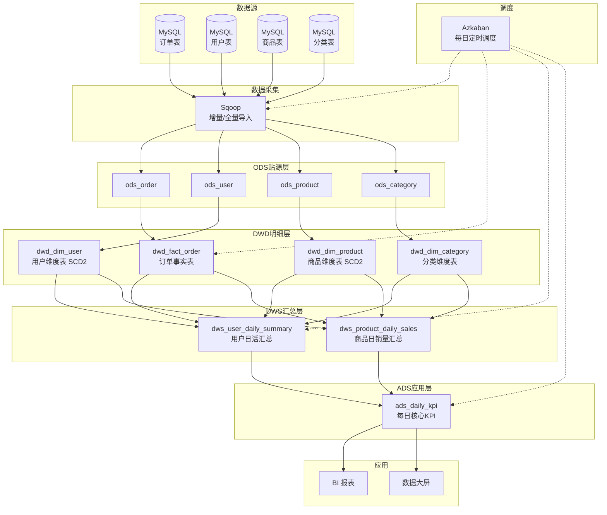

# 电商数据仓库分层架构

[](https://github.com/xqm252/bigdata-warehouse/actions/workflows/verify.yml)
[](https://hive.apache.org/)
[](https://hadoop.apache.org/)
[](https://docs.docker.com/compose/)

> 🎓 大数据工程专业毕业设计/求职展示项目  
> 基于 Hive + Azkaban 的电商数据仓库分层架构设计与实现

---

## 📖 项目简介

模拟某电商公司数据仓库建设全过程：将 MySQL 业务数据库中的订单、用户、商品数据，经过 ETL 清洗与分层建模，最终产出 BI 日报所需的 KPI 指标。

### 核心亮点

- **完整四层架构**：ODS → DWD → DWS → ADS，标准 Kimball 维度建模
- **SCD Type 2 缓慢变化维度**：用户/商品维度可追溯历史变更
- **星型模型设计**：事实表 + 维度表，遵循数据仓库最佳实践
- **Docker 一键部署**：无需手动安装 Hadoop/Hive，`docker-compose up` 即用
- **GitHub Actions 自动验证**：每次 Push 自动启动集群并跑通全链路 ETL

---

## 🏗️ 架构设计

### 数据流转



### 分层说明

| 分层 | 名称 | 职责 | 存储格式 | 关键设计 |
|------|------|------|----------|----------|
| **ODS** | 贴源层 | 与源系统保持一致，不做转换 | TextFile | 外部表 + 日期分区 |
| **DWD** | 明细层 | 数据清洗、维度建模、SCD Type 2 | ORC + SNAPPY | 星型模型，代理键关联 |
| **DWS** | 汇总层 | 按日+用户/商品粒度预聚合 | ORC + SNAPPY | 避免重复扫描事实表 |
| **ADS** | 应用层 | 面向具体指标的宽表 | ORC + SNAPPY | 直接对接 BI 工具 |

### 星型模型

```
                    ┌──────────────────┐
                    │  dwd_dim_user    │
                    │  (用户维度表)     │
                    │  ─────────────── │
                    │  user_sk (PK)    │
                    │  user_id (BK)    │
                    │  user_name       │
                    │  city, province  │
                    │  start_date      │
                    │  end_date ← SCD2 │
                    │  is_current      │
                    └───────┬──────────┘
                            │ 1:N
                            │
    ┌───────────────────┐   │   ┌───────────────────┐
    │ dwd_dim_product   │       │ dwd_dim_category  │
    │ (商品维度表)       │       │ (分类维度表)       │
    │ ───────────────── │       │ ───────────────── │
    │ product_sk (PK)   │       │ category_sk (PK)  │
    │ product_id (BK)   │       │ category_name     │
    │ product_name      │       │ parent_name       │
    │ brand, price      │       │ level             │
    └─────────┬─────────┘       └───────────────────┘
              │ 1:N
              ▼
    ┌──────────────────────────────────────────────┐
    │              dwd_fact_order                   │
    │              (订单事实表)                       │
    │              ─────────────────                │
    │              order_sk (PK)                    │
    │              user_sk (FK)    ────→ 用户维度    │
    │              product_sk (FK) ────→ 商品维度    │
    │              order_amount     (度量)           │
    │              order_status     (度量)           │
    │              create_time      (维度)           │
    └──────────────────────────────────────────────┘
```

---

## 🚀 快速开始

### 环境要求

- **Docker** ≥ 20.10
- **Docker Compose** ≥ 2.0
- 8GB+ 可用内存

### 1. 克隆项目

```bash
git clone https://github.com/xqm252/bigdata-warehouse.git
cd bigdata-warehouse
```

### 2. 一键启动

```bash
# 生成模拟数据
python3 scripts/generate_mock_data.py

# 启动 Hadoop + Hive 集群
docker-compose up -d

# 等待服务就绪（约 60 秒），然后执行全链路 ETL
bash scripts/run_all.sh

# 查看 KPI 结果
docker exec hive-server beeline \
  -u jdbc:hive2://localhost:10000 \
  -e "SELECT * FROM ads.ads_daily_kpi;"
```

### 3. 查看 Web UI

| 服务 | 地址 | 说明 |
|------|------|------|
| HDFS NameNode | http://localhost:9870 | 查看 HDFS 文件 |
| YARN ResourceManager | http://localhost:8088 | 查看 MapReduce 作业 |
| HiveServer2 | jdbc:hive2://localhost:10000 | Hive JDBC 连接 |

---

## 📁 目录结构

```
bigdata-warehouse/
├── .github/workflows/
│   └── verify.yml              # GitHub Actions 自动验证
├── docker/
│   └── hadoop.env              # Hadoop 集群配置
├── scripts/
│   ├── generate_mock_data.py   # 模拟数据生成器
│   └── run_all.sh              # 全链路 ETL 一键执行
├── sql/
│   ├── ods/                    # ODS 贴源层
│   │   ├── ods_order.sql
│   │   ├── ods_user.sql
│   │   ├── ods_product.sql
│   │   └── ods_category.sql
│   ├── dwd/                    # DWD 明细层
│   │   ├── dwd_dim_user.sql    #   DDL — 用户维度表
│   │   ├── dwd_dim_product.sql #   DDL — 商品维度表
│   │   ├── dwd_dim_category.sql#   DDL — 分类维度表
│   │   ├── dwd_fact_order.sql  #   DDL — 订单事实表
│   │   ├── etl_dim_user.sql    #   ETL — 用户 SCD Type 2
│   │   ├── etl_dim_product.sql #   ETL — 商品 SCD Type 2
│   │   ├── etl_dim_category.sql#   ETL — 分类维度
│   │   └── etl_fact_order.sql  #   ETL — 订单事实表
│   ├── dws/                    # DWS 汇总层
│   │   ├── dws_user_daily_summary.sql
│   │   └── dws_product_daily_sales.sql
│   └── ads/                    # ADS 应用层
│       └── ads_daily_kpi.sql
├── data/                       # 模拟数据（gitignore）
├── logs/                       # 运行日志（gitignore）
├── docker-compose.yml          # Docker 编排文件
└── README.md
```

---

## 🔄 ETL 调度流程

```
  每日 02:00  Azkaban 触发
      │
      ▼
  ┌─────────────┐
  │ Sqoop 增量导入│  从 MySQL 拉取昨日增量数据到 HDFS
  └──────┬──────┘
         ▼
  ┌─────────────┐
  │ ODS 添加分区 │  ALTER TABLE ADD PARTITION (dt='${yesterday}')
  └──────┬──────┘
         ▼
  ┌─────────────────────────────────────────┐
  │ DWD 维度表 SCD Type 2 更新              │
  │   Step 1: 旧版本标记失效 (end_date=昨天) │
  │   Step 2: 插入变更记录新版本             │
  └──────┬──────────────────────────────────┘
         ▼
  ┌─────────────┐
  │ DWD 事实表   │  清洗 + 维度代理键关联 + 脏数据过滤
  └──────┬──────┘
         ▼
  ┌─────────────┐
  │ DWS 汇总     │  GROUP BY user_sk/product_sk 预聚合
  └──────┬──────┘
         ▼
  ┌─────────────┐
  │ ADS 指标     │  dau, GMV, 转化率, 客单价, 取消率
  └──────┬──────┘
         ▼
  ┌─────────────┐
  │ 数据质量检查  │  钉钉/邮件告警
  └─────────────┘
```

---

## 📊 产出指标示例

执行完成后 `ads.ads_daily_kpi` 表包含以下字段：

| 指标 | 字段 | 计算逻辑 |
|------|------|----------|
| 日活用户数 | `dau` | 当天下单的独立用户数 |
| 新增用户数 | `new_user_cnt` | 历史首次下单的用户数 |
| 下单数 | `order_cnt` | 当日创建订单数 |
| GMV | `order_amount` | 当日下单总金额 |
| 支付单数 | `pay_cnt` | 已支付的订单数 |
| 支付金额 | `pay_amount` | 已支付的总金额 |
| 支付转化率 | `pay_rate` | 支付单数 / 下单数 |
| 客单价 | `avg_order_amount` | 下单金额 / 下单数 |
| 取消率 | `cancel_rate` | 取消单数 / 下单数 |

---

## 🧪 CI/CD 自动验证

本项目配置了 GitHub Actions，每次 Push 自动执行：

1. 启动 Hadoop + Hive Docker 集群
2. 生成模拟数据并上传 HDFS
3. 执行 ODS → DWD → DWS → ADS 全链路
4. 验证每层数据量
5. 导出运行日志


---

## 🛠️ 技术栈

| 组件 | 版本 | 用途 |
|------|------|------|
| Hadoop HDFS | 3.2.1 | 分布式文件系统 |
| Hive | 2.3.2 | 数据仓库 SQL 引擎 |
| PostgreSQL | 9.6 | Hive Metastore 元数据库 |
| Azkaban | 3.90.0 | 任务调度 |
| Docker Compose | 3.8 | 环境编排 |
| GitHub Actions | — | CI/CD 自动验证 |

---

## 📝 开发计划 / 面试可聊的延伸点

- [ ] **实时数仓**：引入 Kafka + Flink 做实时 ODS → DWD
- [ ] **数据质量监控**：Great Expectations / 自研校验框架
- [ ] **血缘追踪**：Atlas / DataHub 数据血缘
- [ ] **Azkaban → DolphinScheduler**：升级到更现代的调度器
- [ ] **Superset/Metabase**：对接 BI 可视化

---

## 📄 License

MIT License — 仅供学习与展示使用。

---
